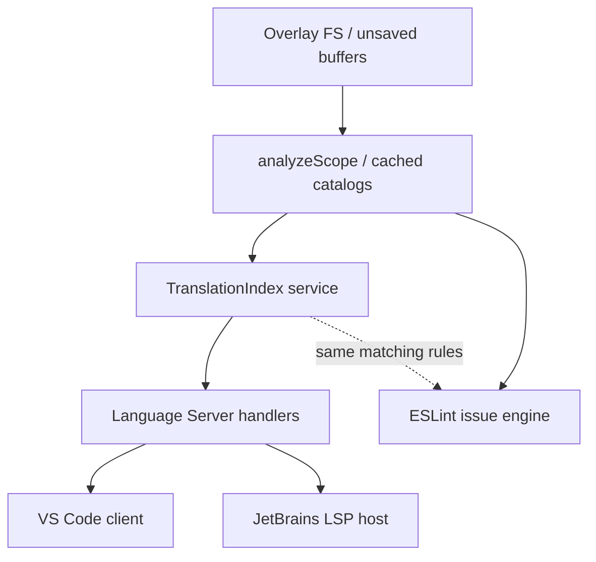

# Phase 20 — Translation Intelligence

## Architecture

There is no `packages/core`. Shared analysis already lives in `@i18n-doctor/sources` + `@i18n-doctor/usages` + `@i18n-doctor/issues` + `@i18n-doctor/cli` (`analyzeScope`). Phase 20 adds a thin **derived index** package and LSP handlers on top of that pipeline.



**Decision (ESLint):** Keep `no-missing-key` on the existing issue engine. Consistency comes from the same `TranslationCatalog` + `definitionMatchesUsage` / `logicalKey` rules. Export shared lookup helpers from the new package so LSP and (later) issues use one contract. Do **not** implement Hover/Completion/Definition via ESLint.

## 1. New package: `@i18n-doctor/translation-index`

Create [`packages/translation-index`](packages/translation-index) depending on `@i18n-doctor/sources`, `@i18n-doctor/usages`, `@i18n-doctor/issues` (for `definitionMatchesUsage` / `logicalKey` / `MatchContext` only).

**Build from existing catalogs only** — no re-parse:

- Input: `TranslationCatalog` (+ optional preferred locales from config: `defaultNS`, `fallbackNS`, base/fallback locale list from effective settings).
- Output: normalized entries:

```ts
interface TranslationIndexEntry {
  key: string;
  namespace: string | null;
  locale: string | null;
  value: TranslationValue;
  sourceFile: string;       // absolute
  relativePath: string;
  range: SourceLocation;    // exact catalog range
  sourceType: SourceFormat; // json | yaml | javascript | typescript
  catalogId: string;        // TranslationSource.id
  fullKey: string;
}
```

**API (pure, sync, O(1)/prefix):**

- `buildTranslationIndex(catalog, options)` → immutable index
- `lookup(key, namespace?, locale?)` → entries (namespace-aware via same rules as issues)
- `definitionsForUsage(usage, matchCtx, preferredLocales)` → best Location(s) for Go-to
- `hoverForUsage(...)` → structured hover model (key, ns, per-locale values, source)
- `completionsForPrefix(prefix, namespace?, limit?)` → unique keys with sample value
- `hasKey(...)` → boolean (same existence rule ESLint/missing-key uses)

**Preferred locale for Go-to:** configured base/default locale when present; else first available locale for that logical key. Multiple catalogs for the same locale: keep all exact ranges; return the best match first (preferred locale), then others as additional locations if useful.

**Invalidation:** index is a pure function of `TranslationCatalog`. Callers rebuild only when `dirty.sources` (or config) flips — never on hover/completion alone.

## 2. Language server: cache + handlers

### Cache

Extend [`packages/language-server/src/cache.ts`](packages/language-server/src/cache.ts) `ScopeCacheEntry` with optional `translationIndex`. Rebuild in [`project.ts`](packages/language-server/src/project.ts) whenever `sourceCatalog` is refreshed; clear when sources dirty. Queries read the cached index only.

### Cursor → usage resolution

Add a small helper in the LS (or translation-index) that, given `(uri, position)`:

1. Finds the open document path
2. Scans **cached** `usageCatalog` (and dynamic usages) for a usage whose `location` contains the position
3. If none and the file is open, optionally run a **file-scoped** usage extract for that buffer only (reuse `@i18n-doctor/usages` detectors) — do **not** full-project rescan
4. Dynamic / unresolved keys → empty definition, empty completion, hover warning only

### Advertise capabilities + wire handlers

Update [`packages/language-server/src/index.ts`](packages/language-server/src/index.ts) / [`server.ts`](packages/language-server/src/server.ts):

- `definitionProvider: true`
- `hoverProvider: true`
- `completionProvider: { triggerCharacters: ['"', "'", ".", ":"] }` (and maybe `` ` `` if needed)

Handlers (thin adapters):

| LSP | Behavior |
|-----|----------|
| `textDocument/definition` | usage under cursor → `definitionsForUsage` → `Location` with exact catalog range |
| `textDocument/hover` | Markdown: key, per-locale values (preferred first), namespace, source `path:line`; missing-key warning; no fabricated values |
| `textDocument/completion` | Only inside static translation-call key literals; prefix filter; namespace-scoped when ns known; dedupe; `detail`/`documentation` = sample translation |

Ensure initialize result and e2e lifecycle tests assert the new capabilities.

**Unsaved buffers:** already handled by overlay FS + cached catalogs from last analysis. On catalog edit, existing debounce refreshes sources → rebuilds index before next hover/completion that waits on dirty; for responsiveness, definition/hover/completion may:

1. If sources dirty for the scope, trigger a **sources-only** refresh (reuse half-pipeline) then answer, or
2. Answer from last good index and let diagnostics catch up

Prefer (1) with a short timeout / single-flight so unsaved locale edits are visible without full usage re-extract.

## 3. VS Code extension

[`packages/vscode`](packages/vscode) already uses `vscode-languageclient` with default client capabilities. **No custom middleware required** once the server advertises definition/hover/completion.

Updates:

- Bump dependency / rebundle server
- README + [`examples/README.md`](packages/vscode/examples/README.md): Go to Translation, Hover, Completion acceptance steps
- Extend e2e ([`tests/e2e.test.ts`](packages/vscode/tests/e2e.test.ts) and/or LS transport tests) to assert capabilities and at least one definition/hover/completion round-trip against demo fixtures

## 4. JetBrains plugin

[`I18nDoctorLspServerDescriptor`](packages/jetbrains/src/main/kotlin/com/i18ndoctor/jetbrains/lsp/I18nDoctorLspSupportProvider.kt) is already a thin `ProjectWideLspServerDescriptor`. Platform LSP host surfaces definition/hover/completion **automatically** when the server advertises them — **no Kotlin translation engine**.

Updates:

- Rebundle LS into plugin resources
- README / MARKETPLACE / examples: document the three features
- Bump plugin version (e.g. `0.11.0`) and change-notes
- Extend [`scripts/e2e-lsp.mjs`](packages/jetbrains/scripts/e2e-lsp.mjs) to assert initialize capabilities include definition/hover/completion

## 5. ESLint

- No Hover/Completion/Definition
- Keep diagnostics path
- Add a small shared-test or unit test that `hasKey` / index lookup agrees with `definitionMatchesUsage` for the same catalog + usage fixtures (including Santez-style `addResourceBundle` co-located `i18n/en.ts` from [`packages/sources/tests/i18next-registration.test.ts`](packages/sources/tests/i18next-registration.test.ts) / [`packages/issues/tests/namespace-regression.test.ts`](packages/issues/tests/namespace-regression.test.ts))
- Optional later: issue engine can call `hasKey` for speed — **out of scope** unless cheap; Phase 20 acceptance is agreement, not rewrite

## 6. Tests (minimum)

**Package `translation-index`:** build from fixtures; lookup; preferred locale; namespace; missing; dynamic skip; prefix completion; dedupe; large catalog prefix perf smoke.

**Language server:** new tests under `packages/language-server/tests/`:

- `definition.test.ts` — simple/nested/ns/alias/multi-locale/JSON/TS/co-located addResourceBundle/missing/dynamic/exact range
- `hover.test.ts` — values, missing warning, ns, unsaved catalog overlay
- `completion.test.ts` — empty/partial/ns prefix/nested/filter/dedupe/dynamic context empty
- Update `lifecycle.test.ts` capabilities
- Integration: same fixture → index `hasKey` === issue `missing-key` absence

Reuse / extend LS fixtures in [`tests/fixtures.ts`](packages/language-server/tests/fixtures.ts); add a Santez-style fixture (co-located + `addResourceBundle`) — repo has no “Santez” name; treat that as the Phase 013.5 pattern.

## 7. Documentation

Update:

- [`packages/language-server/README.md`](packages/language-server/README.md) — remove “diagnostics only”; document the three features
- VS Code + JetBrains READMEs + examples
- Root [`README.md`](README.md) changelog blurb
- Explicit callout:

> ESLint provides diagnostics. Go to Translation, Hover, and Completion are provided by the i18n-doctor Language Server and consumed by the VS Code and JetBrains extensions.

ASCII examples are enough (no real screenshots required in-repo); match existing Phase 16/17 doc style.

## 8. Versioning

Bump `@i18n-doctor/translation-index` as new `0.11.0` (or align monorepo minor), and bump `language-server`, `vscode`, `jetbrains` accordingly. Fix stale `SERVER_VERSION` in `server.ts` (currently `"0.9.1"`) to match package version.

## Non-goals

- Second catalog parser / Kotlin analyzer
- ESLint-based hover/completion/definition
- Full project rescan per hover/keystroke
- Inventing definitions for dynamic keys
